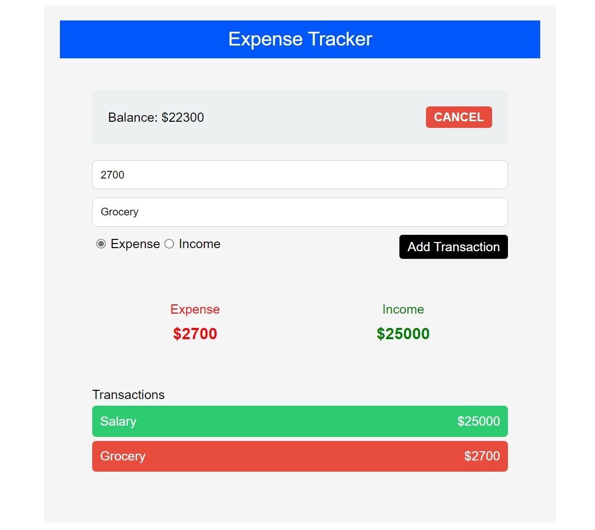

# Expense Tracker React App

Welcome to the Expense Tracker React app! This simple app helps you keep track of your income and expenses. It demonstrates the basic concepts of React through a practical project.

## Project Structure

-   `App.js`: The main component that renders the overall structure of the app.
-   `HomeComponent.js`: The home component that manages the state of transactions, expenses, and income.
-   `OverViewComponent.js`: A sub-component responsible for displaying the balance, adding transactions, and showing the overall expense and income.
-   `TransactionsComponent.js`: A sub-component that displays a list of transactions.

## Getting Started

To run this project locally, follow these steps:

1. **Clone the repository:**

    ```bash
    git clone https://github.com/your-username/expense-tracker-react.git
    ```

2. **Navigate to the project directory:**

    ```bash
    cd expense-tracker-react
    ```

3. **Install dependencies:**

    ```bash
    npm install
    ```

4. **Start the development server:**

    ```bash
    npm start
    ```

5. **Open your browser and visit [http://localhost:3000](http://localhost:3000) to see the app in action.**

## Features

-   **Balance Overview**: View your current balance, including total income and expenses.
-   **Add Transactions**: Easily add new transactions with details such as amount, description, and type (income or expense).
-   **Transaction History**: See a list of all your transactions, categorized by income and expenses.

## Technologies Used

-   React
-   JavaScript
-   CSS

## Project Preview



## Contributing

Feel free to contribute to the project by submitting issues or pull requests. Your feedback is highly appreciated!

## License

This project is licensed under the MIT License - see the [LICENSE](LICENSE) file for details.

Happy tracking! 📊💰
